>## Table Of Content

 - [Getting Started](#getting-started)
   - [Reserved Words](#reserved-words)
   - [Sentences or Lines](#sentences-or-lines)
   - [Python Scripts](#python-scripts)
   - [Program Steps or Program Flow](#program-steps-or-program-flow)
 - [Variables, Expressions, and Statements](#variables-expressions-and-statements)
 - [Conditional Execution](#conditional-execution)
 - [Functions](#functions)
---

>## Getting Started

## Reserved Words

-[TOC](#table-of-content)

These are words that **means exactly what python expects to mean**. That is, you are not allowed to use these words other than for the purpose that Python wants.

```Python
 False   class   return   is       finally
 None    if      for      lambda   continue
 True    def     from     while    nonlocal
 and     del     global   not      with
 as      elif    try      or       yield
 assert  else    import   pass
 break   except  in       raise
```
---

## Sentences or Lines

-[TOC](#table-of-content)

Python reads a line by analysing **Variables, Operator, Constant and Reserved Words** in the line or in the sentences.

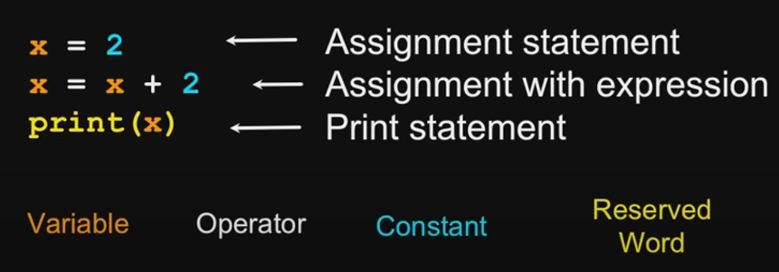

---

## Python Scripts

-[TOC](#table-of-content)

  - Interactive Python is good experiments and programs of 3-4 lines long.
  - Most programs are much longer, so we type them into a file and tell Python to run the commands in the file.
  - In a sense, we are **giving Python a script**.
  - As a convection, we add **.py** as the suffix on the end of these files to indicate they contain Python.

  ---

## Program Steps or Program Flow

-[TOC](#table-of-content)

   - A program is a **Sequence** of steps to be done in order. When a program is running, it flows form one step to next. We set up **paths** for the program to follow.

   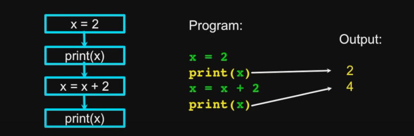

   - Some steps are **Conditional** - they may be skipped.

   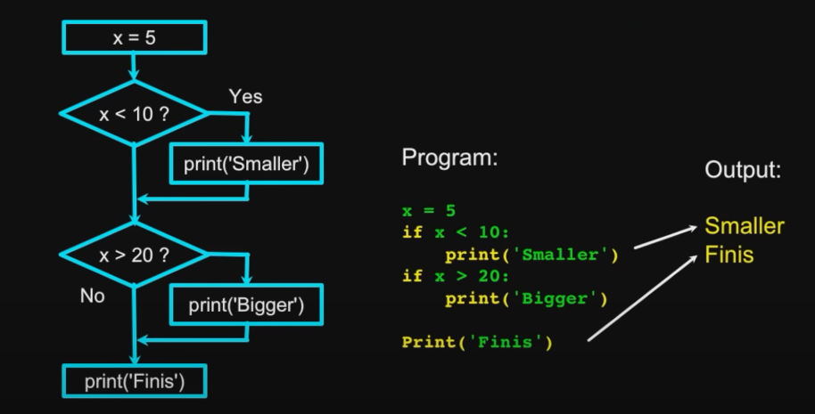

   - Sometimes a step or group of steps is to be **Repeated**. Loops (Repeated steps) have **iteration variables** that change each time through a loop.

   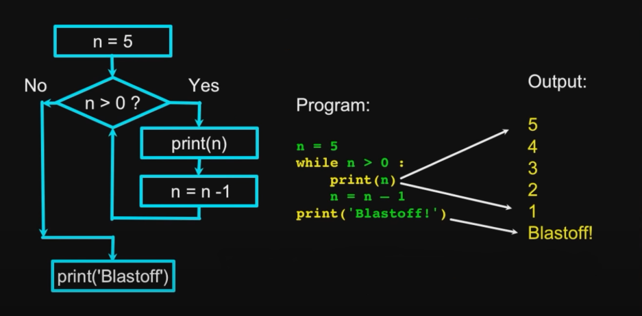

   - Sometimes we store a set of steps to be used over and over as needed in several places throughout the program.

   ---
## Variables, Expressions, and Statements

-[TOC](#table-of-content)

### Constants
  
  - **Fixed values** such as numbers, letters, and strings, are called **constants** because their value does not change.
  - Numeric **constants** are as you expect
  - String **constants** use single quotes **(')** or double quotes **(")**.
  ```Python
  >>> print(123)
  123

  >>> print(98.6)
  98.6

  >>> print('Hello World')
  Hello World
  ```

### Reserved Words

 - You cannot use **Reserved words** as variable names/identifiers.

### Variables

 - A variable is a named place in the memory where a programmer can store data and later retrieve the data using the variable **name**
 - Programmers get to choose the names of the variables.
 
 ```Python
   x = 12.2
   y = 14
 ```  
 - You can change the contents of a variable in a later statement.
 
 ```Python
   x = 12.2
   y = 14
   x = 100
 ```
### Python Variable Name Rules

 - Must start with a letter or underscore _ 
 - Must consist of letters, numbers, and underscores
 - Case Sensitive

 ```Python
   Good:    spam    eggs   spam23    _speed
   Bad:     23spam     #sign  var.12
   Different:    spam   Spam   SPAM
 ```

### Expressions

 - Numeric Expressions
   - Because of the lack of mathematical symbols on computer keyboards - we use **computer-speak** to express the classic math operations.
   - Asterisk is multiplication.
   - Exponentiation (raise to a power) looks different than in math.

        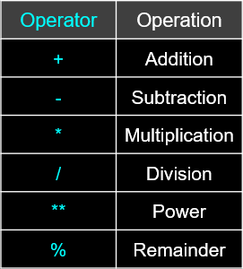

        ```Python
        >>> xx = 2                  
        >>> xx = xx + 2
        >>> print(xx)
        4

        >>> yy = 440 * 12
        >>> print(yy)
        5280

        >>> zz = yy / 1000
        >>> print(zz)
        5.28

        >>> jj = 23
        >>> kk = jj % 5
        >>> print(kk)
        3

        >>> print(4 ** 3)
        64
    - Order of Evaluation :
      - When we string operators together - Python must know which one to do first.
      - This is called **operator precedence**.
      - Which operator **takes precedence** over the others?
      
      ```Python
        x = 1 + 2 * 3 - 4 / 5 ** 6
      ```
    - Operator Precedence Rules.

      Highest precedence rule to lowest precedence rule:

      - Parentheses are always respected
      - Exponentiation (raise to a power)
      - Multiplication, Division, and Remainder
      - Addition and Subtraction
      - Left to right
      ```Python
      >>> x = 1 + 2 ** 3 / 4 * 5
      >>> print(x)
      11.0
    
      >>>
      ```
      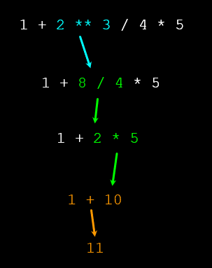 

      - Remember the rules top to bottom.
      - When writing code - use parentheses.
      - When writing code - keep mathematical expressions simple enough that they are easy to understand.
      - Break long series of mathematical operations up to make them more clear.

 - Type

    - In Python variables, literals, and constants have a “**type**”.
    - Python knows the difference between an **integer number** and a **string**.
    - For example “**+**” means “**addition**” if something is a number and “**concatenate**” if something is a string.

    ```Python
    >>> ddd = 1 + 4
    >>> print(ddd)
    5
    >>> eee = 'hello ' + 'there'
    >>> print(eee)
    hello there
    ```

    - Type Matters
        - Python knows what “type” everything is. 
        - Some operations are prohibited.
        - You cannot “add 1” to a string.
        
        ```Python
        >>> eee = 'hello ' + 'there'
        >>> eee = eee + 1
        Traceback (most recent call last):  File "<stdin>", line 1, in <module>TypeError: Can't convert 'int' object to str implicitly
        ```
        - We can ask Python what type something is by using the type() function.

        ```Python
        >>> type(eee)
        <class'str'>
        >>> type('hello')
        <class'str'>
        >>> type(1)
        <class'int'>
        >>>
        ```

    - Numbers have two main types
        -  **Integers** are whole numbers: -14, -2, 0, 1, 100, 401233
        -  **Floating Point Numbers** have  decimal parts: -2.5 , 0.0, 98.6, 14.0
    - There are other number types - they are variations on **float** and **integer**.    
        
        ```Python
        >>> xx = 1
        >>> type (xx)
        <class 'int'>
        >>> temp = 98.6
        >>> type(temp)
        <class'float'>
        >>> type(1)
        <class 'int'>
        >>> type(1.0)
        <class'float'>
        >>>
        ```
    - Type Conversions

        - When you put an integer and floating point in an expression, the integer is implicitly converted to a float.
        - You can control this with the built-in functions int() and float().

        ```Python
        >>> print(float(99) + 100)
        199.0
        >>> i = 42
        >>> type(i)
        <class'int'>
        >>> f = float(i)
        >>> print(f)
        42.0
        >>> type(f)
        <class'float'>
        >>>
        ```
    - String Conversions

        - You can also use int() and float() to convert between strings and integers.
        - You will get an error if the string does not contain numeric characters.

        ```Python
        >>> sval = '123'
        >>> type(sval)
        <class 'str'>
        >>> print(sval + 1)
        Traceback (most recent call last):  File "<stdin>", line 1, in <module>
        TypeError: Can't convert 'int' object to str implicitly
        >>> ival = int(sval)
        >>> type(ival)
        <class 'int'>
        >>> print(ival + 1)
        124
        >>> nsv = 'hello bob'
        >>> niv = int(nsv)
        Traceback (most recent call last):  File "<stdin>", line 1, in <module>
        ValueError: invalid literal for int() with base 10: 'x'
        ```
- User Input

    - We can instruct Python to pause and read data from the user using the input()  function.
    - The input()  function returns a string.

    ```Python
    nam = input('Who are you? ')
    print('Welcome', nam)

    Who are you? Chuck   
    Welcome Chuck
    ```

    - Converting User Input

        - If we want to read a number from the user, we must convert it from a string to a number using a type conversion function.

        ```Python
        inp = input('Europe floor?')
        usf = int(inp) + 1
        print('US floor', usf)

        Europe floor? 0
        US floor 1
        ```

- Comments in Python
    
    - Anything after a **#** is ignored by Python
    - Why comment?
        - Describe what is going to happen in a sequence of code.
        - Document who wrote the code or other ancillary information.
        - Turn off a line of code - perhaps temporarily.

    ```Python
    # Get the name of the file and open it
    name = input('Enter file:')
    handle = open(name, 'r')

    # Count word frequency
    counts = dict()
    for line in handle:
        words = line.split()
        for word in words:
            counts[word] = counts.get(word,0) + 1

    # Find the most common word
    bigcount = None
    bigword = None
    for word,count in counts.items():
        if bigcount is None or count > bigcount:
            bigword = word
            bigcount = count

    # All done
    print(bigword, bigcount
    ```
---    
## Conditional Execution

-[TOC](#table-of-content)

We use the **if statement** here. The **if statement** makes the Python to go one way or the other way. Let the code to check something and make decision based on it.

**If statement** has a question in it and the **:** is the end of the statement.

Problem:
```Python
x = 5
if x < 10:
    print('Smaller')
if x > 20:
    print('Bigger')

print('Finis')
```
Output:
```Python
Smaller
Finis
```
Logic:


### Comparison Operators

- Boolean expressions ask a question and produce a Yes or No result which we use to control program flow
- Boolean expressions using comparison operators evaluate to True / False or Yes / No
- Comparison operators look at variables but do not change the variables

    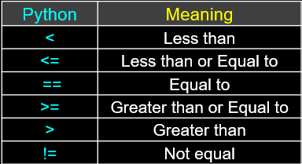

```Python
x = 5
if x == 5 : 
    print('Equals 5')

Equals 5

if x > 4 : 
   print('Greater than 4')

Greater than 4

if  x >= 5 :
    print('Greater than or Equals 5')

Greater than or Equals 5

if x < 6 : print('Less than 6') 

Less than 6

if x <= 5 :
    print('Less than or Equals 5')

Less than or Equals 5

if x != 6 :
    print('Not equal 6')

Not equal 6
```

### Indentation

- **Increase indent** indent after an **if** statement or **for** statement (after : )
- **Maintain indent** to indicate the **scope** of the block (which lines are affected by the **if/for**)
- **Reduce indent** back to the level of the **if** statement or **for** statement to indicate the end of the block
- **Blank lines** are ignored - they do not affect **indentation**
- **Comments** on a line by themselves are ignored with regard to **indentation**

### Nested Decisions

```Python
x = 42
if x > 1 :
    print('More than one')
    if x < 100 : 
        print('Less than 100') 
print('All done')
```

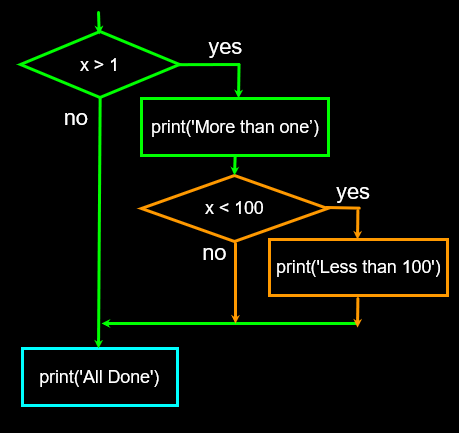

### Two-way Decisions

- Sometimes we want to do one thing if a logical expression is true and something else if the expression is false
- We must choose one or the other path but not both

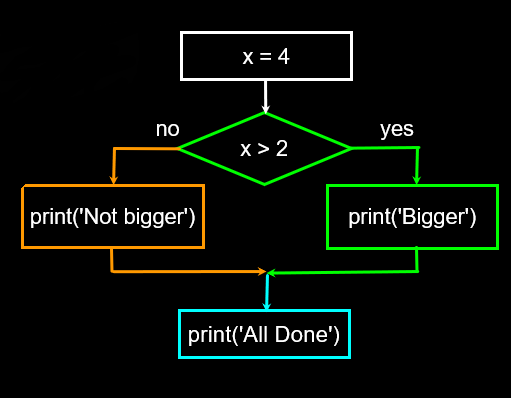

```Python
x = 4

if x > 2 :
    print('Bigger')
else :
    print('Smaller')

print('All done'
```

### Multi Way

It skips the code if it is False and goes on until it becomes True. It checks the question in the order we wrote it.

```Python
if x < 2 :
    print('small')
elif x < 10 :
    print('Medium')
else :
    print('LARGE')
print('All done')
```
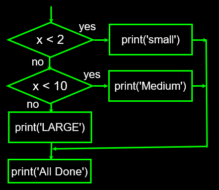

```Python
x = 0 
if x < 2 :
    print('small')
elif x < 10 :
    print('Medium')
else :
    print('LARGE')
print('All done')
```
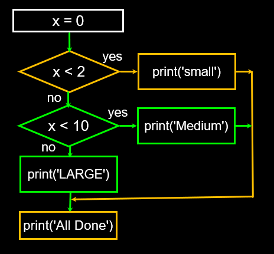

### The try / except Structure

- If the code in the **try** works - the **except** is skipped
- If the code in the **try** fails - it jumps to the **except** section

Program:
```Python
astr = 'Hello Bob'
try:
    istr = int(astr)
except:
    istr = -1

print('First', istr)

astr = '123'
try:
    istr = int(astr)
except:
    istr = -1

print('Second', istr)
```
When the first conversion fails - it just drops into the except: clause and the program continues.

When the second conversion succeeds - it just skips the except: clause and the program continues.

Results:
```Python
First -1
Second 123
```
If you put more than one line inside the **Try** part and if one of the lines blows up, it wont come back to the **Try Block**.

```Python
astr = 'Bob'
try:
    print('Hello') 
    istr = int(astr)
    print('There') 
except:
    istr = -1

print('Done', istr
```
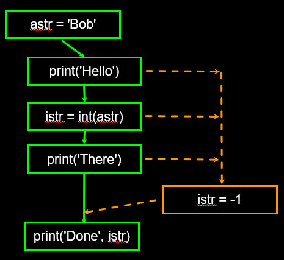

---
## Functions

-[TOC](#table-of-content)

Functions are the **reusable** pieces of code.

### Python Functions

- There are two kinds of functions in Python.
  -  **Built-in functions** that are provided as part of Python - print(), input(), type(), float(), int() ...
  -  **Functions that we define ourselves** and then use
- We treat function names as “new” reserved words (i.e., we avoid them as variable names)

### Function Definition

- In Python a **function** is some reusable code that takes **arguments(s)** as input, does some computation, and then returns a result or results
- We define a **function** using the def reserved word
- We call/invoke the **function** by using the function name, parentheses, and **arguments** in an expression 

### Type Conversions

- When you put an integer and floating point in an expression, the integer is implicitly converted to a float
- You can control this with the built-in functions int() and float()

```Python
>>> print(float(99) / 100)
0.99

>>> i = 42
>>> type(i)
<class 'int'>
>>> f = float(i)
>>> print(f)
42.0

>>> type(f)
<class 'float'>
>>> print(1 + 2 * float(3) / 4 – 5)
-2.5

>>> 
```
### String Conversions

- You can also use int() and float() to convert between strings and integers
- You will get an error if the string does not contain numeric characters

```Python
>>> sval = '123'
>>> type(sval)
<class 'str'>
>>> print(sval + 1)

Traceback (most recent call last):
  File "<stdin>", line 1, in <module>
TypeError: cannot concatenate 'str' and 'int'

>>> ival = int(sval)
>>> type(ival)
<class 'int'>
>>> print(ival + 1)
124

>>> nsv = 'hello bob'
>>> niv = int(nsv)

Traceback (most recent call last):
  File "<stdin>", line 1, in <module>
ValueError: invalid literal for int() 
```
### Building our Own Functions

- Create a new function using the def keyword followed by optional parameters in parentheses
- Indent the body of the function
- This defines the function but does not execute the body of the function

```Python
x = 5
print('Hello')

def print_lyrics():
    print("I'm a lumberjack, and I'm okay.")
    print('I sleep all night and I work all day.')

print('Yo')
x = x + 2
print(x)
```
```Python
Hello
Yo
7
```
### Definitions and Uses

- Once we have defined a function, we can call (or invoke) it as many times as we like
- This is the store and reuse pattern

```Python
x = 5
print('Hello')

def print_lyrics(): 
   print("I'm a lumberjack, and I'm okay.")
   print('I sleep all night and I work all day.')

print('Yo')
print_lyrics()
x = x + 2
print(x)

```
```Python
Hello
Yo
I'm a lumberjack, and I'm okay.
I sleep all night and I work all day.
7
```

### Arguments

- An `argument` is a value we pass into the `function` as its input when we call the `function`
- We use `arguments` so we can direct the `function` to do different kinds of work when we call it at different times
- We put the `arguments` in parentheses after the name of the `function`  

```Python
big = max('Hello world')
```

### Parameters

A **parameter** is a variable which we use in the `function` definition.  It is a “handle” that allows the code in the `function` to access the `arguments` for a particular `function` invocation.

```Python
>>> def greet(lang):
        if lang == 'es':
           print('Hola')
        elif lang == 'fr':
           print('Bonjour')
        else:
           print('Hello')
    
>>> greet('en')
Hello
>>> greet('es')
Hola
>>> greet('fr')
Bonjour
>>> 
```

### Return Values

Often a `function` will take its `arguments`, do some computation, and ***return*** a value to be used as the value of the `function` call in the calling expression.  The `return` keyword is used for this.

```Python
def greet():
    return "Hello"

print(greet(), "Glenn")
print(greet(), "Sally")
```
```Python
Hello Glenn
Hello Sally
```
- A “fruitful” `function` is one that produces a `result` (or `return value`)
The return statement ends the function execution and “sends back” the result of the function

```Python
>>> def greet(lang):
        if lang == 'es':
            return 'Hola'
        elif lang == 'fr':
            return 'Bonjour'
        else:
            return 'Hello'
   
>>> print(greet('en'),'Glenn')
Hello Glenn
>>> print(greet('es'),'Sally')
Hola Sally
>>> print(greet('fr'),'Michael')
Bonjour Michael
>>> 
```

### Multiple Parameters / Arguments

- We can define more than one `parameter` in the `function` definition
- We simply add more `arguments` when we call the `function`
- We match the number and order of `arguments` and `parameters`

```Python
def addtwo(a, b):
    added = a + b
    return added

x = addtwo(3, 5)
print(x)

8
```
### Void (non-fruitful) Functions

- When a function does not return a value, we call it a “void” function
- Functions that return values are “fruitful” functions
- **Void** functions are “not fruitful”

### To function or not to function...

- Organize your code into “paragraphs” - capture a complete thought and “name it”
- Don’t repeat yourself - make it work once and then reuse it
- If something gets too long or complex, break it up into logical chunks and put those chunks in functions
- Make a library of common stuff that you do over and over

---
# ***KEEP LEARNING***

[< Go Back](Python.md)

---


