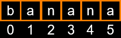
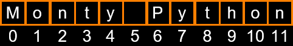
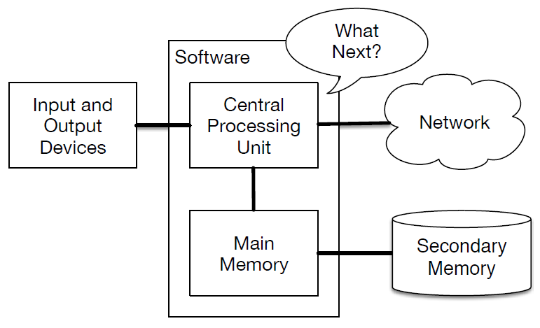
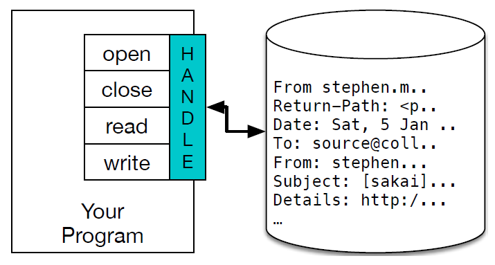

>## Table Of Content

  - [Loops and Iterations](#loops-and-iterations)
  - [Strings](#strings)
  - [Files](#files)
  - [Lists](#lists)
  - [Dictionaries](#dictionaries)
---

# Loops and Iterations

  -[TOC](#table-of-content)

Loops (repeated steps) have <font color=green>iteration variables</font> that change each time through a loop.  Often these iteration variables go through a sequence of numbers. There can also be Infinite Loops.

Example:
```
n = 5
while n > 0 :
    print(n)
    n = n – 1
print('Hello World')
print(n)
```
Output
```
5
4
3
2
1
Hello World
0
```
## Breaking Out of a Loop

We can **Break** out of a Loop using the <font color=green> *break* </font> statement.

- The <font color=green> *break* </font> statement ends the current loop and jumps to the statement immediately following the loop
- It is like a loop test that can happen anywhere in the body of the loop

Example:
```
while True:
    line = input('> ')
    if line == 'done' :
        break
    print(line)
print('Done!')

# This code would generate as per the input by the user. If the given input is same as the line defined, (here, 'done'), then the loop would break by that statement.


> hello world
hello world
> not broken
not broken
> done
Done!
```

## Finishing an Iteration with continue

The <font color=green>continue</font> statement ends the current iteration and jumps to the top of the loop and starts the next iteration.

Example:
```
while True:
    line = input('> ')
    if line[0] == '#' :
        continue
    if line == 'done' :
        break
    print(line)
print('Done!')

> hello world
hello world
> # don't print this
> print this!
print this!
> done
Done!

# on the second input given, which starts with '#', then the line is skipped and continued with the next input.
```

## Definite and Indefinite Loops

| **Definite** | **Indefinite** |
| ---- | ---- |
| Quite often we have a list of items of the lines in a file - effectively a **finite** set of things | While loops are called <font color=yellow>indefinite</font> loops because they keep going until  a logical condition becomes False |
| We can write a loop to run the loop once for each of the items in a set using the Python for construct | The loops we have seen so far are pretty easy to examine to see if they will terminate or if they will be **Infinite loops** |
| These loops are called <font color=green>definite</font> loops because they execute an exact number of times | Sometimes it is a little harder to be sure if a loop will terminate |
| <font color=green>Definite</font> loops iterate through the members of a set |

- A Simple Definite Loop
  
  Definite loops (for loops) have explicit iteration variables that change each time through a loop.  These iteration variables move through the sequence or set.
  - The iteration variable “iterates” through the sequence (ordered set)
  - The block (body) of code is executed once for each value in the sequence
  - The iteration variable moves through all of the values in the sequence

  ```
  for i in [5, 4, 3, 2, 1] :
    print(i)
  print('Hello')

  # Output

  5
  4
  3
  2
  1
  Hello
  ```
- A Definite Loop with Strings
  ```
  friends = ['A', 'B', 'C']
  for friend in friends : 
   print('Happy New Year:', friend)
  print('Done!')

  # Output

  Happy New Year: A
  Happy New Year: B
  Happy New Year: C
  Done!
  ```
# What We Do in Loops?

- Making Smart Loops
  
  The trick is knowing something about the whole loop when you are stuck writing code that only sees one entry at a time

  - Set some variables to initial values
  - `for thing in data:`
  
    - Look for something or do something to each entry separately, updating a variable
    - Look at the variables

Looping through a Set
```
print('Before')
for thing in [9, 41, 12, 3, 74, 15] :
     print(thing)
print('After')

# Output

Before
9
41
12
3
74
15
After
```

## Finding the Largest Value

We make a variable that contains the largest value we have seen so far. If the current number we are looking at is larger, it is the new largest value we have seen so far.

```
largest_so_far = -1
print('Before', largest_so_far)
for the_num in [9, 41, 12, 3, 74, 15] :
   if the_num > largest_so_far :
      largest_so_far = the_num
   print(largest_so_far, the_num)

print('After', largest_so_far)

# Output

Before -1
9    9
41  41
41  12
41   3
74  74
74  15
After 74
```

## Counting in a Loop
 
To **count** how many times we execute a loop, we introduce a counter variable that starts at 0 and we add one to it each time through the loop.

```
a = 0
print('Before', a)
for thing in [9, 41, 12, 3, 74, 15] :
    a = a + 1
    print(a, thing)
print('After', a)

# Output

Before 0
1 9
2 41
3 12
4 3
5 74
6 15
After 6
```

## Summing in a Loop

To **add** up a value we encounter in a loop,  we introduce a <font color=green>sum</font> variable that starts at 0 and we add the value to the <font color=green>sum</font> each time through the loop.

```
a = 0
print('Before', a)
for thing in [9, 41, 12, 3, 74, 15] :
    a = a + thing
    print(a, thing)
print('After', a)

# Output

Before 0
9 9
50 41
62 12
65 3
139 74
154 15
After 154
```

## Finding the Average in a Loop  
 
An <font color=green>average</font> just combines the **counting** and **sum** patterns and divides when the loop is done.

```
count = 0
sum = 0
print('Before', count, sum)
for value in [9, 41, 12, 3, 74, 15] :
    count = count + 1
    sum = sum + value
    print(count, sum, value)
print('After', count, sum, sum / count)

# Output

Before 0 0
1 9 9
2 50 41
3 62 12
4 65 3
5 139 74
6 154 15
After 6 154 25.666
```

## Filtering in a Loop

We use an <font color=yellow>if statement</font> in the loop to catch / filter the values we are looking for.
```
print('Before')
for value in [9, 41, 12, 3, 74, 15] :
    if value > 20:
 	    print('Large number',value)
print('After')

# Output

Before
Large number 41
Large number 74
After
```

## Search Using a Boolean Variable

If we just want to search and know if a value was found, we use a variable that starts at **False** and is set to **True** as soon as we find what we are looking for.
```
found = False
print('Before', found)
for value in [9, 41, 12, 3, 74, 15] : 
   if value == 3 :
       found = True
   print(found, value)
print('After', found)

# Output

Before False
False 9
False 41
False 12
True 3
True 74
True 15
After True
```

## Finding the Smallest Value

The first time through the loop smallest is None, so we take the first value to be the smallest.

- The is and is not Operators

   - Python has an **is** operator that can be used in logical expressions
   - Implies *is the same as*
   - Similar to, but stronger than ==
   - **is not**  also is a logical operator

```
smallest = None
print('Before')
for value in [9, 41, 12, 3, 74, 15] :
    if smallest is None : 
        smallest = value
    elif value < smallest : 
        smallest = value
    print(smallest, value)
print('After', smallest)

# Output

Before
9 9
9 41
9 12
3 3
3 74
3 15
After 3
```
---
# Strings

  -[TOC](#table-of-content)

- A <font color=green>string</font> is a sequence of characters
- A <font color=green>string</font> literal uses quotes 'Hello' or "Hello"
- For strings, + means **concatenate**
- When a <font color=green>string</font> contains numbers, it is still a <font color=green>string</font>
- We can convert numbers in a <font color=green>string</font> into a number using int()

<font color=grey>Example:</font>
```

>>> str1 = "Hello"
>>> str2 = 'there'
>>> bob = str1 + str2
>>> print(bob)
Hellothere

>>> str3 = '123'
>>> str3 = str3 + 1
Traceback (most recent call last):  File "<stdin>", line 1, in <module>
TypeError: cannot concatenate 'str' and 'int' objects

>>> x = int(str3) + 1
>>> print(x)
124
>>> 
```
## Reading and Converting

We prefer to read data in using strings and then parse and convert the data as we need
This gives us more control over error situations and/or bad user input
Input numbers must be converted from strings

<font color=grey>Example:</font>
```

>>> name = input('Enter:')
Enter:Chuck
>>> print(name)
Chuck

>>> apple = input('Enter:')
Enter:100
>>> x = apple – 10
Traceback (most recent call last):  File "<stdin>", line 1, in <module>
TypeError: unsupported operand type(s) for -: 'str' and 'int'
>>> x = int(apple) – 10
>>> print(x)
90
```

## Looking Inside Strings

- We can get at any single character in a string using an index specified in square brackets
- The index value must be an integer and starts at zero
- The index value can be an expression that is computed



<font color=grey>Example:</font>
```

>>> fruit = 'banana'
>>> letter = fruit[1]
>>> print(letter)
a
>>> x = 3
>>> w = fruit[x - 1]
>>> print(w)
n
```

- You will get a python error if you attempt to index beyond the end of a string
- So be careful when constructing index values and slices
```
>>> zot = 'abc'
>>> print(zot[5])
Traceback (most recent call last):  File "<stdin>", line 1, in <module>
IndexError: string index out of range
>>> 
```

## String Length

The built-in function <font color=green>len</font> gives us the length of a string
```
>>> fruit = 'banana'
>>> print(len(fruit))
6
```

## Looping Through Strings

Using a <font color=green>while statement</font>, an iteration variable, and the <font color=green>len function</font>, we can construct a loop to look at each of the letters in a string individually

<font color=grey>Example:</font>
```
fruit = 'banana'
index = 0
while index < len(fruit): 
    letter = fruit[index]
    print(index, letter)
    index = index + 1

# Output

0 b
1 a
2 n
3 a
4 n
5 a
```

- A definite loop using a <font color=green>for</font> statement is much more elegant
- The iteration variable is completely taken care of by the <font color=green>for</font> loop
  
```
fruit = 'banana'
for letter in fruit: 
    print(letter)

# Output

b
a
n
a
n
a
```

## Looping and Counting

This is a simple loop that loops through each letter in a string and counts the number of times the loop encounters the 'a' character
```
word = 'banana'
count = 0
for letter in word :
    if letter == 'a' : 
       count = count + 1
print(count)
```
- The iteration variable “iterates” through the sequence (ordered set)
- The block (body) of code is executed once for each value in the sequence
- The iteration variable moves through all of the values in the sequence
```
for letter in 'banana' :
      print(letter)
```

## Slicing Strings

- We can also look at any continuous section of a string using a **colon operator**
- The second number is one beyond the end of the slice - “up to but not including”
- If the second number is beyond the end of the string, it stops at the end 

If we leave off the first number or the last number of the slice, it is assumed to be the beginning or end of the string respectively


```
>>> s = 'Monty Python'
>>> print(s[0:4])
Mont

>>> print(s[6:7])
P

>>> print(s[6:20])
Python

>>> s = 'Monty Python'
>>> print(s[:2])
Mo

>>> print(s[8:])
thon

>>> print(s[:])
Monty Python
```

## String Concatenation

When the  "<font color=red>+</font>"  operator is applied to strings, it means **concatenation**

```
>>> a = 'Hello'
>>> b = a + 'There'
>>> print(b)
HelloThere

>>> c = a + ' ' + 'There'
>>> print(c)
Hello There

>>> 
```

## Using <font color=yellow>in</font> as a Logical Operator

- The <font color=green>in</font> keyword can also be used to check to see if one string is **in** another string
- The <font color=green>in</font> expression is a logical expression that returns True or False and can be used in an if statement

<font color=grey>Example:</font>
```
>>> fruit = 'banana'
>>> 'n' in fruit
True
>>> 'm' in fruit
False
>>> 'nan' in fruit
True
>>> if 'a' in fruit :
...     print('Found it!')
...
Found it!
>>> 
```

## String Library

- Python has a number of string <font color=green>functions</font> which are in the string library
- These <font color=green>functions</font> are already built into every string - we invoke them by appending the function to the string variable
- These <font color=green>functions</font> do not modify the original string, instead they return a new string that has been altered
```
>>> greet = 'Hello Bob'
>>> zap = greet.lower()
>>> print(zap)
hello bob

>>> print(greet)
Hello Bob

>>> print('Hi There'.lower())
hi there

>>>
```

The **type** of string can be known by using <font color=green>type</font> and the available <font color=green>type</font> in the string library by using <font color=green>dir</font>
```
>>> stuff = 'Hello world'
>>> type(stuff)
<class 'str'>
>>> dir(stuff)
['capitalize', 'casefold', 'center', 'count', 'encode', 'endswith', 'expandtabs', 'find', 'format', 'format_map', 'index', 'isalnum', 'isalpha', 'isdecimal', 'isdigit', 'isidentifier', 'islower', 'isnumeric', 'isprintable', 'isspace', 'istitle', 'isupper', 'join', 'ljust', 'lower', 'lstrip', 'maketrans', 'partition', 'replace', 'rfind', 'rindex', 'rjust', 'rpartition', 'rsplit', 'rstrip', 'split', 'splitlines', 'startswith', 'strip', 'swapcase', 'title', 'translate', 'upper', 'zfill']
```

More about the String Library is available on https://docs.python.org/3/library/stdtypes.html#string-methods

Commonly used from the String Library are,
```
str.capitalize()
str.center(width[, fillchar])
str.endswith(suffix[, start[, end]])
str.find(sub[, start[, end]])
str.lstrip([chars])
str.replace(old, new[, count])
str.lower()
str.rstrip([chars])
str.strip([chars])
str.upper()
```

## Searching a String

- We use the <font color=green>find()</font> function to search for a substring within another string
- <font color=green>find()</font> finds the first occurrence of the substring
- If the substring is not found, <font color=green>find()</font> returns -1
- Remember that string position starts at zero

<font color=grey>Example:</font>
```

>>> fruit = 'banana'
>>> pos = fruit.find('na')
>>> print(pos)
2

>>> aa = fruit.find('z')
>>> print(aa)
-1
```

## Making everything UPPER CASE

- You can make a copy of a string in lower case or upper case
- Often when we are searching for a string using <font color=green>find()</font> we first convert the string to lower case so we can search a string regardless of case

<font color=grey>Example:</font>
```
>>> greet = 'Hello Bob'
>>> nnn = greet.upper()
>>> print(nnn)
HELLO BOB

>>> www = greet.lower()
>>> print(www)
hello bob

>>> 
```

## Search and Replace

The <font color=green>replace()</font> function is like a “search and replace” operation in a word processor
It replaces all occurrences of the search string with the replacement string

<font color=grey>Example:</font>
```
>>> greet = 'Hello Bob'
>>> nstr = greet.replace('Bob','Jane')
>>> print(nstr)
Hello Jane
>>> nstr = greet.replace('o','X')
>>> print(nstr)
HellX BXb
>>> 
```

---

# Files

  -[TOC](#table-of-content)

So far, we have learned how to write programs and communicate our intentions to the Central Processing Unit using conditional execution, functions, and iterations.

We have learned how to create and use data structures in the Main Memory. The **CPU** and memory are where our software works and runs. It is where all of the **thinking** happens.
But once the power is turned off, anything stored in either the **CPU** or main memory is erased. So up to now, our programs have just been transient fun exercises to learn Python.



In this chapter, we start to work with <font color=yellow>Secondary Memory</font> (or files). Secondary memory is not erased when the power is turned off. Or in the case of a USB flash drive, the data we write from our programs can be removed from the system and transported to another system.

We will primarily focus on reading and writing text files such as those we create in a text editor. Later we will see how to work with database files which are binary files, specifically designed to be read and written through database software.

## Opening Files

When we want to read or write a file (say on your hard drive), we first must open the file. Opening the file communicates with your operating system, which knows where the data for each file is stored. When you open a file, you are asking the operating system to find the file by name and make sure the file exists.

In this example, we open the file ***mbox.txt***, which should be stored in the same folder that you are in when you start Python.
```
>>> fhand = open('mbox.txt')
>>> print(fhand)
<_io.TextIOWrapper name='mbox.txt' mode='r' encoding='cp1252'>
```

If the **open** is successful, the operating system returns us a ***file handle***. The file handle is not the actual data contained in the file, but instead it is a **handle** that we can use to read the data. You are given a handle if the requested file exists and you have the proper permissions to read the file.


If the file does not exist, open will fail with a traceback and you will not get a handle to access the contents of the file:
```
>>> fhand = open('stuff.txt')
Traceback (most recent call last):
File "<stdin>", line 1, in <module>
FileNotFoundError: [Errno 2] No such file or directory: 'stuff.txt'
```

## Text files and lines

A text file can be thought of as a sequence of lines, much like a Python string can be thought of as a sequence of characters. For example, this is a sample of a text file which records mail activity from various individuals in an open source project development team:
```
From stephen.marquard@uct.ac.za Sat Jan 5 09:14:16 2008
Return-Path: <postmaster@collab.sakaiproject.org>
Date: Sat, 5 Jan 2008 09:12:18 -0500
To: source@collab.sakaiproject.org
From: stephen.marquard@uct.ac.za
Subject: [sakai] svn commit: r39772 - content/branches/
Details: http://source.sakaiproject.org/viewsvn/?view=rev&rev=39772
...
```

These files are in a standard format for a file containing multiple mail messages. The lines which start with “From” separate the messages and the lines which start with “From:” are part of the messages.

To break the file into lines, there is a special character that represents the “end of the line” called the **newline** character.

In Python, we represent the **newline** character as a backslash-n in string constants.
Even though this looks like two characters, it is actually a single character. When we look at the variable by entering “stuff” in the interpreter, it shows us the **<font color=yellow>\n</font>** in the string, but when we use print to show the string, we see the string broken into two lines by the newline character.
```
>>> stuff = 'Hello\nWorld!'
>>> stuff
'Hello\nWorld!'
>>> print(stuff)
Hello
World!
>>> stuff = 'X\nY'
>>> print(stuff)
X
Y
>>> len(stuff)
3
```
You can also see that the length of the string **X\nY** is three characters because the newline character is a single character.

## Reading files

While the file handle does not contain the data for the file, it is quite easy to construct a for loop to read through and count each of the lines in a file:
```
fhand = open('mbox-short.txt')
count = 0
for line in fhand:
count = count + 1
print('Line Count:', count)
```

We can use the file handle as the sequence in our for loop. Our for loop simply counts the number of lines in the file and prints them out. The rough translation of the for loop into English is, “for each line in the file represented by the file handle, add one to the count variable.”

The reason that the open function does not read the entire file is that the file might be quite large with many gigabytes of data. The open statement takes the same amount of time regardless of the size of the file. The for loop actually causes the data to be read from the file.

When the file is read using a for loop in this manner, Python takes care of splitting the data in the file into separate lines using the newline character. Python reads each line through the newline and includes the newline as the last character in the line variable for each iteration of the for loop. Because the for loop reads the data one line at a time, it can efficiently read and count the lines in very large files without running out of main memory to store the data. The above program can count the lines in any size file using very little memory since each line is read, counted, and then discarded.

If you know the file is relatively small compared to the size of your main memory, you can read the whole file into one string using the read method on the file handle.
```
>>> fhand = open('mbox-short.txt')
>>> inp = fhand.read()
>>> print(len(inp))
94626
>>> print(inp[:20])
From stephen.marquar
```

In this example, the entire contents of the file **mbox-short.txt** are read directly into the variable inp. We use string slicing to print out the first 20 characters of the string data stored in inp.

When the file is read in this manner, all the characters including all of the lines and newline characters are one big string in the variable inp. It is a good idea to store the output of read as a variable because each call to read exhausts the resource:
```
>>> fhand = open('mbox-short.txt')
>>> print(len(fhand.read()))
94626
>>> print(len(fhand.read()))
0
```

## Searching Through a File

We can put an **if** statement in our **for** loop to only print lines that meet some criteria
```
fhand = open('mbox-short.txt')
for line in fhand:
    if line.startswith('From:') :
        print(line)
```
```
From: stephen.marquard@uct.ac.za

From: louis@media.berkeley.edu

From: zqian@umich.edu

From: rjlowe@iupui.edu
...
```
OOPS!
What are all these blank lines doing here?

- Each line from the file has a newline at the end
- The print statement adds a newline to each line

That is,
```
From: stephen.marquard@uct.ac.za\n
\n
From: louis@media.berkeley.edu\n
\n
From: zqian@umich.edu\n
\n
From: rjlowe@iupui.edu\n
\n
...
```
- We can strip the whitespace from the right-hand side of the string using <font color=green>rstrip()</font> from the string library
- The newline is considered **white space** and is stripped

```
fhand = open('mbox-short.txt')
for line in fhand:
    line = line.rstrip()
    if line.startswith('From:') :
        print(line)
```
```
From: stephen.marquard@uct.ac.za
From: louis@media.berkeley.edu
From: zqian@umich.edu
From: rjlowe@iupui.edu
....
```

## Skipping with continue

We can conveniently skip a line by using the <font color=green>continue</font> statement
```
fhand = open('mbox-short.txt')
for line in fhand:
    line = line.rstrip()
    if not line.startswith('From:') :
        continue
    print(line)
```

## Using in to Select Lines

We can look for a string anywhere <font color=green>in</font> a line as our selection criteria
```
fhand = open('mbox-short.txt')
for line in fhand:
    line = line.rstrip()
    if not '@uct.ac.za' in line : 
        continue
    print(line)
```
```
From stephen.marquard@uct.ac.za Sat Jan  5 09:14:16 2008
X-Authentication-Warning: set sender to stephen.marquard@uct.ac.za using –f
From: stephen.marquard@uct.ac.za
Author: stephen.marquard@uct.ac.za
From david.horwitz@uct.ac.za Fri Jan  4 07:02:32 2008
X-Authentication-Warning: set sender to david.horwitz@uct.ac.za using -f...
```    

## Prompt for File Name

```
fname = input('Enter the file name:  ')
fhand = open(fname)
count = 0
for line in fhand:
    if line.startswith('Subject:') :
        count = count + 1
print('There were', count, 'subject lines in', fname)
```
```
Enter the file name:  mbox.txt
There were 1797 subject lines in mbox.txt

Enter the file name: mbox-short.txt
There were 27 subject lines in mbox-short.txt
```

## Bad File Names

```
fname = input('Enter the file name:  ')
  try:
      fhand = open(fname)
  except:
      print('File cannot be opened:', fname)
      quit()

  count = 0
  for line in fhand:
      if line.startswith('Subject:') :
          count = count + 1
  print('There were', count, 'subject lines in', fname)
```
```
Enter the file name: mbox.txt
There were 1797 subject lines in mbox.txt

Enter the file name: na na boo boo
File cannot be opened: na na boo boo
```
---

# Lists

  -[TOC](#table-of-content)

## Programming

- Algorithm
 -  A set of rules or steps used to solve a problem

- Data Structure
 -  A particular way of organizing data in a computer
  
## What is Not a **Collection**?  

Most of our variables have one value in them - when we put a new value in the variable, the old value is overwritten
```
$ python
>>> x = 2
>>> x = 4
>>> print(x)
4
```
## A List is a Kind of Collection

- A collection allows us to put many values in a single “variable”
- A collection is nice because we can carry all many values around in one convenient package.
```
friends = [ 'Joseph', 'Glenn', 'Sally' ]

carryon = [ 'socks', 'shirt', 'perfume' ]
```

## List Constants

- List constants are surrounded by square brackets and the elements in the list are separated by commas
- A list element can be any Python object - even another list
- A list can be empty
```
>>> print([1, 24, 76])
[1, 24, 76]

>>> print(['red', 'yellow', 'blue'])
['red', 'yellow', 'blue']

>>> print(['red', 24, 98.6])
['red', 24, 98.6]

>>> print([ 1, [5, 6], 7])
[1, [5, 6], 7]

>>> print([])
[]
```

## Lists and Definite Loops 

```
friends = ['Joseph', 'Glenn', 'Sally']
for friend in friends :
    print('Happy New Year:',  friend)
print('Done!')
```
```
Happy New Year: Joseph
Happy New Year: Glenn
Happy New Year: Sally
Done!
```

## Looking Inside Lists

Just like strings, we can get at any single element in a list using an index specified in square brackets
```
>>> friends = [ 'Joseph', 'Glenn', 'Sally' ]
>>> print(friends[1])
Glenn
>>> 
```

## Lists are Mutable

- Strings are “immutable” - we cannot change the contents of a string - we must make a new string to make any change
- Lists are “mutable” - we can change an element of a list using the index operator
```
>>> fruit = 'Banana'
>>> fruit[0] = 'b'
Traceback 
TypeError: 'str' object does not 
support item assignment

>>> x = fruit.lower()
>>> print(x)
banana


>>> lotto = [2, 14, 26, 41, 63]
>>> print(lotto)
[2, 14, 26, 41, 63]
>>> lotto[2] = 28
>>> print(lotto)
[2, 14, 28, 41, 63]
```

## How Long is a List?

- The **len()** function takes a list as a parameter and returns the number of elements in the list
- Actually **len()** tells us the number of elements of any set or sequence (such as a string...)

```
>>> greet = 'Hello Bob'
>>> print(len(greet))
9
>>> x = [ 1, 2, 'joe', 99]
>>> print(len(x))
4
>>> 
```

## Using the range Function

- The <font color=green>range</font> function returns a list of numbers that range from zero to one less than the parameter
- We can construct an index loop using for and an integer iterator
```
>>> print(range(4))
[0, 1, 2, 3]
>>> friends = ['Joseph', 'Glenn', 'Sally']
>>> print(len(friends))
3
>>> print(range(len(friends)))
[0, 1, 2]
>>> 
```

## Concatenating Lists Using +

We can create a new list by adding two existing lists together
```
>>> a = [1, 2, 3]
>>> b = [4, 5, 6]
>>> c = a + b
>>> print(c)
[1, 2, 3, 4, 5, 6]
>>> print(a)
[1, 2, 3]
```

## Lists Can Be Sliced Using :

Just like in strings, the second number is “up to but not including”
```
>>> t = [9, 41, 12, 3, 74, 15]
>>> t[1:3]
[41,12]
>>> t[:4]
[9, 41, 12, 3]
>>> t[3:]
[3, 74, 15]
>>> t[:]
[9, 41, 12, 3, 74, 15]
```

## List Methods

```
>>> x = list()
>>> type(x)
<type 'list'>
>>> dir(x)
['append', 'count', 'extend', 'index', 'insert', 'pop', 'remove', 'reverse', 'sort']
>>> 
```

## Building a List from Scratch

- We can create an empty list and then add elements using the append method
- The list stays in order and new elements are added at the end of the list
```
>>> stuff = list()
>>> stuff.append('book')
>>> stuff.append(99)
>>> print(stuff)
['book', 99]
>>> stuff.append('cookie')
>>> print(stuff)
['book', 99, 'cookie']
```

## Is Something in a List?

- Python provides two operators that let you check if an item is in a list
- These are logical operators that return **True** or **False**
- They do not modify the list
```
>>> some = [1, 9, 21, 10, 16]
>>> 9 in some
True
>>> 15 in some
False
>>> 20 not in some
True
>>> 
```

## Lists are in Order

- A list can hold many items and keeps those items in the order until we do something to change the order
- A list can be sorted (i.e., change its order)
- The sort method (unlike in strings) means “sort yourself”
```
>>> friends = [ 'Joseph', 'Glenn', 'Sally' ]
>>> friends.sort()
>>> print(friends)
['Glenn', 'Joseph', 'Sally']
>>> print(friends[1])
Joseph
>>> 
```

## Built-in Functions and Lists

- There are a number of functions built into Python that take lists as parameters
- Remember the loops we built?  These are much simpler.
```
>>> nums = [3, 41, 12, 9, 74, 15]
>>> print(len(nums))
6
>>> print(max(nums))
74
>>> print(min(nums))
3
>>> print(sum(nums))
154
>>> print(sum(nums)/len(nums))
25.6
```

## Strings and Lists

<font color=green>Split</font> breaks a string into parts and produces a list of strings.  We think of these as words.  We can access a particular word or loop through all the words.
```
>>> abc = 'With three words'
>>> stuff = abc.split()
>>> print(stuff)
['With', 'three', 'words']
>>> print(len(stuff))
3
>>> print(stuff[0])
With
```
```
>>> print(stuff)
['With', 'three', 'words']
>>> for w in stuff :
...     print(w)
...
With
Three
Words
>>> 
```
When you do not specify a delimiter, multiple spaces are treated like one delimiter
```
>>> line = 'A lot               of spaces'
>>> etc = line.split()
>>> print(etc)
['A', 'lot', 'of', 'spaces']
>>>
>>> line = 'first;second;third'
>>> thing = line.split()
>>> print(thing)
['first;second;third']
>>> print(len(thing))
1
```
You can specify what delimiter character to use in the splitting
```
>>> thing = line.split(';')
>>> print(thing)
['first', 'second', 'third']
>>> print(len(thing))
3
>>> 
```

## The Double Split Pattern

Sometimes we split a line one way, and then grab one of the pieces of the line and split that piece again

<font color=grey>Example:</font>
```
From stephen.marquard@uct.ac.za Sat Jan  5 09:14:16 2008
```
```
>>> words = line.split()
>>> email = words[1]
stephen.marquard@uct.ac.za

>>> pieces = email.split('@')
['stephen.marquard', 'uct.ac.za']

>>> print(pieces[1])
uct.ac.za
```
---

# Dictionaries

  -[TOC](#table-of-content)

## What is a Collection?

- A collection is nice because we can put more than one value in it and carry them all around in one convenient package
- We have a bunch of values in a single variable
- We do this by having more than one place <font color=green>in</font> the variable
- We have ways of finding the different places in the variable

## What is Not a “Collection”?

Most of our variables have one value in them - when we put a new value in the variable - the old value is overwritten
```
>>> x = 2
>>> x = 4
>>> print(x)
4
```

## List And Dictionary

- List
  - A linear collection of values that stay in order

- Dictionary
   - A “bag” of values, each with its own label

## Dictionaries

- Dictionaries are Python’s most powerful data collection
- Dictionaries allow us to do fast database-like operations in Python
- Dictionaries have different names in different languages
  -  Associative Arrays - Perl / PHP
  -  Properties or Map or HashMap - Java
  -  Property Bag - C# / .Net

- Lists index their entries based on the position in the list
- Dictionaries are like bags - no order
- So we index the things we put in the dictionary with a 
<font color=yellow>lookup tag</font>

```
>>> purse = dict()
>>> purse['money'] = 12
>>> purse['candy'] = 3
>>> purse['tissues'] = 75
>>> print(purse)
{'money': 12, 'tissues': 75, 'candy': 3}
>>> print(purse['candy'])
3
>>> purse['candy'] = purse['candy'] + 2
>>> print(purse)
{'money': 12, 'tissues': 75, 'candy': 5}
```

## Comparing Lists and Dictionaries

Dictionaries are like lists except that they use keys instead of numbers to look up values
```
>>> lst = list()
>>> lst.append(21)
>>> lst.append(183)
>>> print(lst)
[21, 183]
>>> lst[0] = 23
>>> print(lst)
[23, 183]
```
```
>>> ddd = dict()
>>> ddd['age'] = 21
>>> ddd['course'] = 182
>>> print(ddd)
{'course': 182, 'age': 21}
>>> ddd['age'] = 23
>>> print(ddd)
{'course': 182, 'age': 23}
```

## Many Counters with a Dictionary

One common use of dictionaries is counting how often we “see” something
```
>>> ccc = dict()
>>> ccc['csev'] = 1
>>> ccc['cwen'] = 1
>>> print(ccc)
{'csev': 1, 'cwen': 1}
>>> ccc['cwen'] = ccc['cwen'] + 1
>>> print(ccc)
{'csev': 1, 'cwen': 2}
```

## Dictionary Tracebacks

- It is an error to reference a key which is not in the dictionary
- We can use the in operator to see if a key is in the dictionary
```
>>> ccc = dict()
>>> print(ccc['csev'])
Traceback (most recent call last):
  File "<stdin>", line 1, in <module>
KeyError: 'csev'
>>> 'csev' in ccc
False
```

## When We See a New Name

When we encounter a new name, we need to add a new entry in the dictionary and if this the second or later time we have seen the name, we simply add one to the count in the dictionary under that name
```
counts = dict()
names = ['csev', 'cwen', 'csev', 'zqian', 'cwen']
for name in names :
    if name not in counts: 
       counts[name] = 1
    else :
        counts[name] = counts[name] + 1
print(counts)
{'csev': 2, 'zqian': 1, 'cwen': 2}
```

## The <font color=yellow>get</font> Method for Dictionaries

The pattern of checking to see if a key is already in a dictionary and assuming a default value if the key is not there is so common that there is a method called <font color=green>get()</font> that does this for us

- Default value if key does not exist (and no Traceback).
```
x = counts.get(name, 0)

{'csev': 2, 'zqian': 1, 'cwen': 2}
```

## Simplified Counting with <font color=yellow>get</font>

We can use <font color=green>get()</font> and provide a default value of zero when the key is not yet in the dictionary - and then just add one
```
counts = dict()
names = ['csev', 'cwen', 'csev', 'zqian', 'cwen']
for name in names :
    counts[name] = counts.get(name, 0) + 1
print(counts)
{'csev': 2, 'zqian': 1, 'cwen': 2}
```

## Counting Pattern

The general pattern to count the words in a line of text is to <font color=green>split</font> the line into words, then loop through the words and use a dictionary to track the count of each word independently.

```
counts = dict()
print('Enter a line of text:')
line = input('')

words = line.split()

print('Words:', words)

print('Counting...')
for word in words:
    counts[word] = counts.get(word,0) + 1
print('Counts', counts)
```
```
Enter a line of text:
the clown ran after the car and the car ran into the tent and the tent fell down on the clown and the car 
 
Words: ['the', 'clown', 'ran', 'after', 'the', 'car', 'and', 'the', 'car', 'ran', 'into', 'the', 'tent', 'and', 'the', 'tent', 'fell', 'down', 'on', 'the', 'clown', 'and', 'the', 'car']
Counting…

Counts {'and': 3, 'on': 1, 'ran': 2, 'car': 3, 'into': 1, 'after': 1, 'clown': 2, 'down': 1, 'fell': 1, 'the': 7, 'tent': 2}
```

## Definite Loops and Dictionaries

Even though dictionaries are not stored in order, we can write a for loop that goes through all the entries in a dictionary - actually it goes through all of the keys in the dictionary and looks up the values
```
>>> counts = { 'chuck' : 1 , 'fred' : 42, 'jan': 100}
>>> for key in counts:
...     print(key, counts[key])
... 
jan 100
chuck 1
fred 42
>>> 
```

## Retrieving Lists of Keys and Values

You can get a list of keys, values, or items (both) from a dictionary
```
>>> jjj = { 'chuck' : 1 , 'fred' : 42, 'jan': 100}
>>> print(list(jjj))
['jan', 'chuck', 'fred']
>>> print(list(jjj.keys()))
['jan', 'chuck', 'fred']
>>> print(list(jjj.values()))
[100, 1, 42]
>>> print(list(jjj.items()))
[('jan', 100), ('chuck', 1), ('fred', 42)]
>>> 
```

## Two Iteration Variables!

- We loop through the key-value pairs in a dictionary using *two* iteration variables
- Each iteration, the first variable is the key and the second variable is the corresponding value for the key
```
jjj = { 'chuck' : 1 , 'fred' : 42, 'jan': 100}
for aaa,bbb in jjj.items() :
    print(aaa, bbb)


 
jan 100
chuck 1
fred 42
```
---
< [Go Back](README.md)