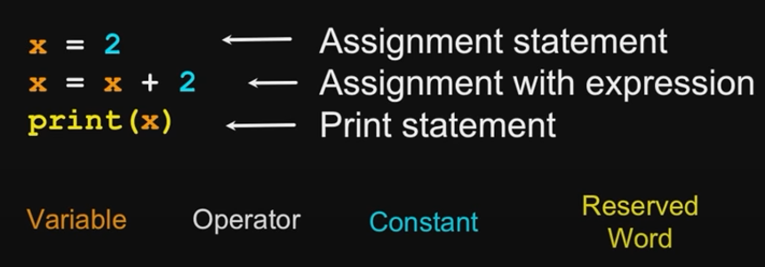
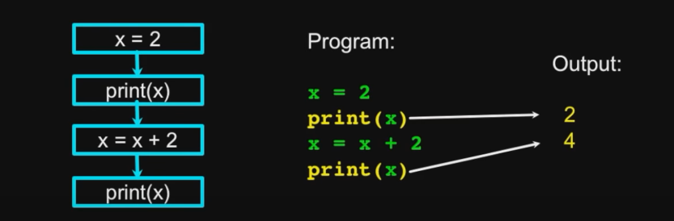
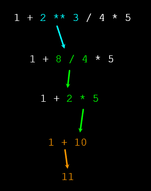

# PYTHON

>## Table Of Content

 - [Getting Started](#getting-started)
   - [Reserved Words](#reserved-words)
   - [Sentences or Lines](#sentences-or-lines)
   - [Python Scripts](#python-scripts)
   - [Program Steps or Program Flow](#program-steps-or-program-flow)
 - [Variables, Expressions, and Statements](#variables-expressions-and-statements)

---

>## Getting Started

## Reserved Words

-[TOC](#table-of-content)

These are words that **means exactly what python expects to mean**. That is, you are not allowed to use these words other than for the purpose that Python wants.

```Python
 False   class   return   is       finally
 None    if      for      lambda   continue
 True    def     from     while    nonlocal
 and     del     global   not      with
 as      elif    try      or       yield
 assert  else    import   pass
 break   except  in       raise
```
---

## Sentences or Lines

-[TOC](#table-of-content)

Python reads a line by analysing **Variables, Operator, Constant and Reserved Words** in the line or in the sentences.



---

## Python Scripts

-[TOC](#table-of-content)

  - Interactive Python is good experiments and programs of 3-4 lines long.
  - Most programs are much longer, so we type them into a file and tell Python to run the commands in the file.
  - In a sense, we are **giving Python a script**.
  - As a convection, we add **.py** as the suffix on the end of these files to indicate they contain Python.

  ---

## Program Steps or Program Flow

-[TOC](#table-of-content)

   - A program is a **Sequence** of steps to be done in order. When a program is running, it flows form one step to next. We set up **paths** for the program to follow.

   

   - Some steps are **Conditional** - they may be skipped.

   

   - Sometimes a step or group of steps is to be **Repeated**. Loops (Repeated steps) have **iteration variables** that change each time through a loop.

   

   - Sometimes we store a set of steps to be used over and over as needed in several places throughout the program.

   ---
## Variables, Expressions, and Statements

-[TOC](#table-of-content)

### Constants
  
  - **Fixed values** such as numbers, letters, and strings, are called **constants** because their value does not change.
  - Numeric **constants** are as you expect
  - String **constants** use single quotes **(')** or double quotes **(")**.
  ```Python
  >>> print(123)
  123

  >>> print(98.6)
  98.6

  >>> print('Hello World')
  Hello World
  ```

### Reserved Words

 - You cannot use **Reserved words** as variable names/identifiers.

### Variables

 - A variable is a named place in the memory where a programmer can store data and later retrieve the data using the variable **name**
 - Programmers get to choose the names of the variables.
 
 ```Python
   x = 12.2
   y = 14
 ```  
 - You can change the contents of a variable in a later statement.
 
 ```Python
   x = 12.2
   y = 14
   x = 100
 ```
### Python Variable Name Rules

 - Must start with a letter or underscore _ 
 - Must consist of letters, numbers, and underscores
 - Case Sensitive

 ```Python
   Good:    spam    eggs   spam23    _speed
   Bad:     23spam     #sign  var.12
   Different:    spam   Spam   SPAM
 ```

### Expressions

 - Numeric Expressions
   - Because of the lack of mathematical symbols on computer keyboards - we use **computer-speak** to express the classic math operations.
   - Asterisk is multiplication.
   - Exponentiation (raise to a power) looks different than in math.

        

        ```Python
        >>> xx = 2                  
        >>> xx = xx + 2
        >>> print(xx)
        4

        >>> yy = 440 * 12
        >>> print(yy)
        5280

        >>> zz = yy / 1000
        >>> print(zz)
        5.28

        >>> jj = 23
        >>> kk = jj % 5
        >>> print(kk)
        3

        >>> print(4 ** 3)
        64
    - Order of Evaluation :
      - When we string operators together - Python must know which one to do first.
      - This is called **operator precedence**.
      - Which operator **takes precedence** over the others?
      
      ```Python
        x = 1 + 2 * 3 - 4 / 5 ** 6
      ```
    - Operator Precedence Rules.

      Highest precedence rule to lowest precedence rule:

      - Parentheses are always respected
      - Exponentiation (raise to a power)
      - Multiplication, Division, and Remainder
      - Addition and Subtraction
      - Left to right
      ```Python
      >>> x = 1 + 2 ** 3 / 4 * 5
      >>> print(x)
      11.0
    
      >>>
      ```
       

      - Remember the rules top to bottom.
      - When writing code - use parentheses.
      - When writing code - keep mathematical expressions simple enough that they are easy to understand.
      - Break long series of mathematical operations up to make them more clear.

 - Type

    - In Python variables, literals, and constants have a “**type**”.
    - Python knows the difference between an **integer number** and a **string**.
    - For example “**+**” means “**addition**” if something is a number and “**concatenate**” if something is a string.

    ```Python
    >>> ddd = 1 + 4
    >>> print(ddd)
    5
    >>> eee = 'hello ' + 'there'
    >>> print(eee)
    hello there
    ```

    - Type Matters
        - Python knows what “type” everything is. 
        - Some operations are prohibited.
        - You cannot “add 1” to a string.
        
        ```Python
        >>> eee = 'hello ' + 'there'
        >>> eee = eee + 1
        Traceback (most recent call last):  File "<stdin>", line 1, in <module>TypeError: Can't convert 'int' object to str implicitly
        ```
        - We can ask Python what type something is by using the type() function.

        ```Python
        >>> type(eee)
        <class'str'>
        >>> type('hello')
        <class'str'>
        >>> type(1)
        <class'int'>
        >>>
        ```

    - Numbers have two main types
        -  **Integers** are whole numbers: -14, -2, 0, 1, 100, 401233
        -  **Floating Point Numbers** have  decimal parts: -2.5 , 0.0, 98.6, 14.0
    - There are other number types - they are variations on **float** and **integer**.    
        
        ```Python
        >>> xx = 1
        >>> type (xx)
        <class 'int'>
        >>> temp = 98.6
        >>> type(temp)
        <class'float'>
        >>> type(1)
        <class 'int'>
        >>> type(1.0)
        <class'float'>
        >>>
        ```
    - Type Conversions

        - When you put an integer and floating point in an expression, the integer is implicitly converted to a float.
        - You can control this with the built-in functions int() and float().

        ```Python
        >>> print(float(99) + 100)
        199.0
        >>> i = 42
        >>> type(i)
        <class'int'>
        >>> f = float(i)
        >>> print(f)
        42.0
        >>> type(f)
        <class'float'>
        >>>
        ```
    - String Conversions

        - You can also use int() and float() to convert between strings and integers.
        - You will get an error if the string does not contain numeric characters.

        ```Python
        >>> sval = '123'
        >>> type(sval)
        <class 'str'>
        >>> print(sval + 1)
        Traceback (most recent call last):  File "<stdin>", line 1, in <module>
        TypeError: Can't convert 'int' object to str implicitly
        >>> ival = int(sval)
        >>> type(ival)
        <class 'int'>
        >>> print(ival + 1)
        124
        >>> nsv = 'hello bob'
        >>> niv = int(nsv)
        Traceback (most recent call last):  File "<stdin>", line 1, in <module>
        ValueError: invalid literal for int() with base 10: 'x'
        ```
- User Input

    - We can instruct Python to pause and read data from the user using the input()  function.
    - The input()  function returns a string.

    ```Python
    nam = input('Who are you? ')
    print('Welcome', nam)

    Who are you? Chuck   
    Welcome Chuck
    ```

    - Converting User Input

        - If we want to read a number from the user, we must convert it from a string to a number using a type conversion function.

        ```Python
        inp = input('Europe floor?')
        usf = int(inp) + 1
        print('US floor', usf)

        Europe floor? 0
        US floor 1
        ```

- Comments in Python
    
    - Anything after a **#** is ignored by Python
    - Why comment?
        - Describe what is going to happen in a sequence of code.
        - Document who wrote the code or other ancillary information.
        - Turn off a line of code - perhaps temporarily.

    ```Python
    # Get the name of the file and open it
    name = input('Enter file:')
    handle = open(name, 'r')

    # Count word frequency
    counts = dict()
    for line in handle:
        words = line.split()
        for word in words:
            counts[word] = counts.get(word,0) + 1

    # Find the most common word
    bigcount = None
    bigword = None
    for word,count in counts.items():
        if bigcount is None or count > bigcount:
            bigword = word
            bigcount = count

    # All done
    print(bigword, bigcount
    ```


---
# ***KEEP LEARNING***
---

